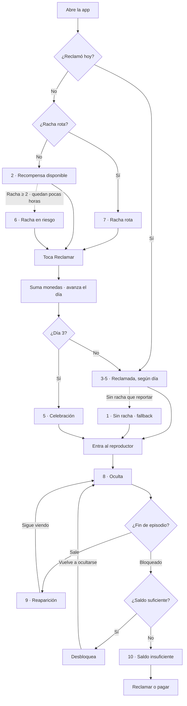

# estados.md — Barra de racha persistente

> **Estado de este documento.** Describe la **primera versión** de la intervención: una barra
> de 56px con diez estados y un mensaje a la vez. Esa barra evolucionó a la **Player Identity
> Card** (`components/PlayerCard/`), que es lo que el POC muestra hoy.
>
> Lo de acá **no quedó obsoleto**: los diez estados son la máquina que sigue corriendo por
> debajo de la tarjeta (`lib/streak/`). Deciden si hay algo que reclamar, qué día de racha va
> y cuánto paga mañana. Lo que cambió es la superficie que los muestra, no la lógica.
>
> El copy por estado que documenta este archivo ya no se renderiza tal cual: la tarjeta
> presenta saldo, racha y recompensa juntos en vez de un mensaje a la vez.


**Qué es:** activación de la franja inferior que ya existe en el reproductor de Idilio, que
hoy solo muestra un saldo mudo. Pasa a comunicar saldo + estado de racha + próxima meta,
y a estar presente en toda la app.

**Qué NO es:** una pantalla nueva, un dashboard, ni un tab. Es una capa.

**Principio:** un estado a la vez, el más urgente. Si muestra todo, no comunica nada.

---

## Anatomía

```
┌────────────────────────────────────────────────┐
│  🪙 45        🔥 Día 2 · ██░  →  Día 3: +60   │  ← 56px + safe area
└────────────────────────────────────────────────┘
   izquierda      centro/derecha: estado activo
   (saldo, ya      (lo nuevo)
    existe hoy)
```

- **Altura:** 56px + safe area. Nunca más del 12% de la pantalla.
- **Posición:** anclada al borde inferior. Sobre la tab bar en Inicio/Recompensas/Perfil;
  sola sobre el video en el reproductor.
- **Fondo:** `--bg` con blur cuando va sobre video; opaco en el resto.
- **Área táctil:** toda la barra, mínimo 44pt de alto.
- **Al tocarla:** abre el modal de racha existente. No se rediseña ese modal salvo la
  corrección de la curva.

### Indicador de progreso

Tres segmentos que miden el tramo **hasta el día 3**, el único hito con evidencia dura.

| Segmento | Token | Valor |
|---|---|---|
| Lleno | `--violet` | `#7B2FF7` |
| Vacío | `--track` | `#2E2E2E` |

**Tres y no siete.** Siete segmentos en 56px de alto producen astillas ilegibles, y la meta
del día 7 ya viaja en el copy (`Día 7: +250`). El indicador responde "¿cuánto falta para el
próximo hito?", no "¿dónde estoy en la semana?".

**Aparece solo en los estados 3, 4 y 5** — los únicos que no llevan CTA. Así el violeta del
indicador nunca compite con el pill del estado 2, que es el que tiene que ganar la mirada.

Contraste y descarte de `--surface-2`: documentados en `design-tokens.md`.

### Por qué abajo
Vertical, una mano, 54% de sesiones entre 11pm y 2am, Android de gama de entrada con
pantallas grandes. La zona superior es la menos alcanzable con el pulgar. Además la app ya
puso el saldo abajo en el reproductor: se respeta el patrón que el usuario ya conoce.

---

## Estados

### 1 · Sin racha, nada que reclamar
**Cuándo:** ya reclamó y no hay racha que reportar.
**Muestra:** saldo. Texto: `Vuelve mañana y gana monedas`.
**Acción:** toque abre el modal de racha.
**Por qué:** presenta el sistema sin pedir nada. No hay CTA porque no hay nada que reclamar.

> **Corrección — contradicción resuelta.** Este estado decía antes "usuario sin racha,
> primera sesión", sin CTA. Eso chocaba con el estado 10: el mismo recién llegado, al chocar
> con el muro, sí recibía `Reclama +20 hoy` con botón. O el día 1 se reclama en la primera
> sesión o no se reclama.
>
> Se resolvió **a favor de que sí**, por tres razones: es lo que hace la app real (el modal
> de racha muestra el día 1 ya reclamado desde la primera sesión, `referencias/IMG_9300`);
> el diagnóstico D1 pide exactamente eso, el reclamo a un toque sin esperar un día; y hacer
> esperar 24 horas desperdicia el momento de mayor atención del usuario.
>
> Consecuencia: **la primera sesión ahora es el estado 2.** El estado 1 queda como fallback
> —default seguro de la cadena de prioridad— y ya no ocurre en el flujo normal. Sigue siendo
> inspeccionable desde el panel de demo.

### 2 · Recompensa disponible ★ estado de máxima urgencia
**Cuándo:** hay algo que reclamar hoy. Incluye la primera sesión, que reclama el día 1.
**Muestra:** saldo + `🔥 Reclama +35` con botón pill `--grad-cta` y `--glow-violet`.
**Acción:** reclamo directo desde la barra. **Sin navegar a Recompensas.**
**Por qué:** es la corrección central del 19%. Hoy hay que atravesar dos planes de
suscripción y tres paquetes de monedas para llegar al camino gratuito. Acá está a un toque.
**Único estado con glow.** Si el glow aparece en tres estados, deja de significar urgencia.

### 3 · Reclamada — día 1
**Cuándo:** reclamó hoy, racha = 1.
**Muestra:** saldo actualizado + `🔥 Día 1 · ▓░░ → Día 2: +35`.
**Por qué:** la meta siguiente es visible desde el primer día. Hoy el usuario no sabe que
está en una racha ni qué gana si la sostiene.

### 4 · Reclamada — día 2
**Muestra:** `🔥 Día 2 · ▓▓░ → Día 3: +60`.
**Por qué:** es el paso previo al umbral de 2.4x en D30. El día 3 debe leerse como cerca.

### 5 · Meta alcanzada — día 3
**Cuándo:** reclamó el día 3.
**Muestra:** celebración breve (`~2s`), luego `🔥 Día 3 · Racha viva → Día 7: +250`.
**Por qué:** es el único hito con evidencia dura. Merece un momento, no un cambio de número.
Y reencuadra hacia la meta larga para que el logro no se sienta terminal.

### 6 · Racha en riesgo
**Cuándo:** no ha reclamado y quedan pocas horas del día.
**Muestra:** `🔥 Tu racha de 4 días termina en 3h` + CTA de reclamo.
**Por qué:** es el único reloj real del sistema. Idilio hoy no tiene ninguno.
**Restricción:** solo aparece si ya hay racha ≥2. A un usuario sin racha no se le puede
generar urgencia sobre algo que no tiene.

### 7 · Racha rota
**Cuándo:** volvió después de perderla.
**Muestra:** `Empezamos de nuevo · Reclama +20`.
**Por qué:** no regaña, no muestra lo perdido. Un usuario que vuelve después de romper la
racha ya se castigó solo; recordárselo produce abandono.
**Copy prohibido:** "Perdiste", "Se acabó", cualquier cifra de lo perdido.

### 8 · Oculta
**Cuándo:** reproductor con video corriendo y controles ocultos.
**Transición:** fade + translate Y, 200ms, `ease-out`.
**Por qué:** el video vertical a pantalla completa es el producto. Ningún píxel permanente.

### 9 · Reaparición
**Cuándo:** transición entre episodios, pausa, o salida del reproductor.
**Transición:** entrada 250ms, `ease-out`.
**Por qué:** es el momento de decisión — seguir, salir, desbloquear. La barra llega justo
cuando la información sirve.

### 10 · Saldo insuficiente
**Cuándo:** toca desbloquear y no le alcanza.
**Muestra:** saldo en `--danger` + `Te faltan 15 · Reclama +35 hoy`.
**Por qué:** conecta el sumidero con el grifo en el momento exacto de fricción. Hoy ese
momento solo ofrece pagar.
**Restricción:** el camino de pago sigue presente y sin degradar. La barra añade la
alternativa gratuita, no la reemplaza. Si canibaliza la compra, se ajusta el techo de la
racha, no se esconde el botón de pago.

---

## Estados y prioridad

Cuando varios apliquen, gana el de arriba:
```
10  Saldo insuficiente
 6  Racha en riesgo
 2  Recompensa disponible
 7  Racha rota
 5  Meta día 3
3,4 Reclamada
 1  Sin racha · fallback
```

---

## Corrección de la curva de racha

La curva actual retrocede en día 4 y 5. Propuesta monotónica, mismo total ±:

```
actual     +15  +40  +60  +50  +40  +45  +200
propuesta  +20  +35  +60  +75  +90 +110  +250
```

Racionales:
- **Día 1 sube de 15 a 20** para que sobre algo después de desbloquear un episodio. Con 15
  exactos el saldo vuelve a cero y no hay acumulación posible.
- **Nunca retrocede.** Es la condición mínima de un sistema de progresión.
- **El día 3 mantiene 60**, el salto perceptible al umbral que importa.
- **Total ~640 vs ~450.** Es más moneda regalada: el tradeoff se declara y se compensa con
  el volumen de desbloqueos. El techo exacto es decisión de negocio con datos de ARPU.

---

## Microcopy

**Esta tabla es la fuente de verdad del copy**, por encima de la sección "Estados" de arriba
— que arrastra montos de la curva vieja (`+15`, `+200`) y textos más largos. Todos los
montos de acá salen de la **curva corregida**: `+20 +35 +60 +75 +90 +110 +250`.

| Estado | Mensaje | Botón | Indicador |
|---|---|---|---|
| 1 | `Vuelve mañana y gana monedas` | — | — |
| 2 | — | `Reclamar +35` | — |
| 3 | `Día 1 · Mañana +35` | — | `▓░░` |
| 4 | `Día 2 · Mañana +60` | — | `▓▓░` |
| 5 | `¡Día 3! · Día 7: +250` | — | `▓▓▓` |
| 6 | `Vence en 3h` | `Reclamar +75` | — |
| 7 | `Empieza de nuevo` | `Reclamar +20` | — |
| 10 | `Te faltan 15` | `Reclamar +35` | — |

Los montos del botón son **dinámicos**: salen de la curva según el día que toca reclamar.
`+35` es el valor cuando el usuario va por el día 2; con racha en cero sería `+20`.

### Corrección — el monto vive en el CTA

La tabla anterior ponía el monto en el mensaje (`Empezamos de nuevo · Reclama +20`) al lado
de un botón que decía `Reclamar`. Dos problemas:

1. **Redundancia.** El mensaje repetía el verbo y el número que el botón ya llevaba.
2. **No entraba.** En 390px, con saldo a la izquierda y botón a la derecha, el mensaje del
   estado 7 necesitaba 261px sobre ~163px disponibles. Se intentó truncar desde el inicio
   para salvar el número, y el resultado fue `… nuevo · Reclama +20` — español roto y el
   sentido del estado perdido, que era justamente no regañar.

Se aplicó la regla de craft del proyecto —"antes de dar por cerrado un estado, quitar un
elemento"— y el monto se movió al botón. El mensaje se queda con lo único que el botón no
puede decir: **el estado**. El botón dice **la acción y su precio**.

**El presupuesto, medido.** La barra tiene 338px útiles (370 de pantalla − 16 de margen a
cada lado). El saldo ocupa ~37 y el botón con monto hasta ~132 (`Reclamar +250`, el peor
caso), más 16 de separación. Al mensaje le quedan **~150px**, unos 18 caracteres. Los textos
de los estados con CTA se escribieron contra esa medida, no contra una estimación:

- `Vence en 3h` (102px) en vez de `Tu racha termina en 3h` (165px). El sujeto es obvio —es
  la barra de racha y al lado hay un botón de reclamo—, y la forma corta cumple mejor
  "verbo primero" que la larga.
- `Empieza de nuevo` (140px) en vez de `Empezamos de nuevo` (157px). Además de entrar,
  respeta "tú informal" y "verbo primero"; sigue sin regañar y sin mostrar lo perdido.

Efectos: el estado 2 se queda sin mensaje (`🪙 45` … `[Reclamar +35]`) porque el botón ya lo
dice todo; ningún estado trunca; y "el número siempre visible" se cumple mejor que antes,
con el saldo a la izquierda y el monto en el CTA. El nombre de la acción se mantiene:
botón `Reclamar +35` → resultado `Reclamado`.

El indicador es un **elemento visual**, no caracteres de bloque: los `▓░░` de la tabla solo
notan cuántos segmentos van llenos.

Reglas: verbo primero, número siempre visible, sin signos de admiración salvo en el hito,
tú informal. El botón dice "Reclamar" y el resultado dice "Reclamado".

---

## Flujo

Este grafo es la fuente. Lo replican, con el mismo contenido, el artboard `Flujo` del canvas
y la sección 03 de la página de entrega — **si se toca acá, se tocan los tres**. Y la fuente de la fuente es `lib/streak/select.ts`: el orden
de guardas del selector es lo que el grafo dibuja.

Dos aristas que parecen naturales y son imposibles: **6 no puede salir de «Reclamada»**
(el selector exige `!claimedToday` y 3-5 exige lo contrario), y **7 no es terminal** — tiene
CTA `Reclamar`, así que desemboca en el reclamo como 2 y 6.



---

## Alcance del POC

**Se construye:** estados 1–5, 8, 9, 10 + panel de control de demo para saltar entre días
y estados.

**Si sobra tiempo:** 6 y 7.

**No se construye:** login, home, catálogo, reproductor real, pagos, backend.

El panel de demo se etiqueta como herramienta de evaluación. Sin él una racha de 7 días es
imposible de evaluar en una sesión de revisión.
